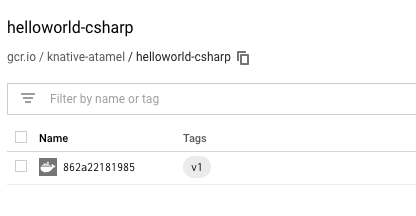

In this step, let's utilize Tekton Pipelines to build containers and push to Google Container Registry (GCR).

## Design the Task

[Kaniko](https://github.com/GoogleContainerTools/kaniko) is a tool to build container images from a Dockerfile, inside a container in Kubernetes cluster. The advantage is that Kaniko doesn't depend on a Docker daemon. Let's create a generic Task to use Kaniko.

Create a [task-build-docker-images-from-git-source.yaml](../build/task-build-docker-images-from-git-source.yaml) file:

```yaml
apiVersion: tekton.dev/v1alpha1
kind: Task
metadata:
  name: build-docker-image-from-git-source
spec:
  inputs:
    resources:
      - name: docker-source
        type: git
    params:
      - name: pathToDockerFile
        type: string
        description: The path to the dockerfile to build
        default: /workspace/docker-source/Dockerfile
      - name: pathToContext
        type: string
        description:
          The build context used by Kaniko
          (https://github.com/GoogleContainerTools/kaniko#kaniko-build-contexts)
        default: /workspace/docker-source
  outputs:
    resources:
      - name: builtImage
        type: image
  steps:
    - name: build-and-push
      image: gcr.io/kaniko-project/executor:v0.9.0
      # specifying DOCKER_CONFIG is required to allow kaniko to detect docker credential
      env:
        - name: "DOCKER_CONFIG"
          value: "/builder/home/.docker/"
      command:
        - /kaniko/executor
      args:
        - --dockerfile=$(inputs.params.pathToDockerFile)
        - --destination=$(outputs.resources.builtImage.url)
        - --context=$(inputs.params.pathToContext)
```

This defines a generic Task to use Kaniko to download the source code in the 'workspace' directory and then use Kaniko to build and push an image to GCR.

Create the task:

```bash
kubectl apply -f task-build-docker-images-from-git-source.yaml

task.tekton.dev/build-docker-image-from-git-source created
```

## Design the TaskRun

Next, let's define a TaskRun to run the Task. Create a [taskrun-build-helloworld-gcr.yaml](../build/taskrun-build-helloworld-gcr.yaml) file:

```yaml
apiVersion: tekton.dev/v1alpha1
kind: PipelineResource
metadata:
  name: git-knative-tutorial
spec:
  type: git
  params:
    - name: revision
      value: master
    - name: url
      # Point to Git url
      value: https://github.com/meteatamel/knative-tutorial
---
apiVersion: tekton.dev/v1alpha1
kind: PipelineResource
metadata:
  name: image-gcr-knative-tutorial
spec:
  type: image
  params:
    - name: url
      # Replace {PROJECT_ID} with your GCP Project's ID.
      value: gcr.io/{PROJECT_ID}/helloworld:tekton
---
apiVersion: tekton.dev/v1alpha1
kind: TaskRun
metadata:
  name: build-helloworld-gcr
spec:
  taskRef:
    name: build-docker-image-from-git-source
  inputs:
    resources:
      - name: docker-source
        resourceRef:
          name: git-knative-tutorial
    params:
      - name: pathToDockerFile
        value: Dockerfile
      - name: pathToContext
        # Point to Dockerfile
        value: /workspace/docker-source/serving/helloworld/csharp
  outputs:
    resources:
      - name: builtImage
        resourceRef:
          name: image-gcr-knative-tutorial
```

This TaskRun defines the source code to build, the location of the image to push to and it refers to the Task we defined previously. 

## Run and watch the TaskRun

You can start the TaskRun with:

```bash
kubectl apply -f taskrun-build-helloworld-docker.yaml

pipelineresource.tekton.dev/git-knative-tutorial unchanged
pipelineresource.tekton.dev/image-docker-knative-tutorial created
taskrun.tekton.dev/build-helloworld-docker created
```

Check that all the Tekton artifacts are created:

```bash
kubectl get tekton-pipelines

NAME                                                        AGE
pipelineresource.tekton.dev/git-knative-tutorial            12m
pipelineresource.tekton.dev/image-docker-knative-tutorial   22s
pipelineresource.tekton.dev/image-gcr-knative-tutorial      12m

NAME                                         SUCCEEDED   REASON      STARTTIME   COMPLETIONTIME
taskrun.tekton.dev/build-helloworld-docker   Unknown     Building    22s
taskrun.tekton.dev/build-helloworld-gcr      True        Succeeded   12m         10m

NAME                                                 AGE
task.tekton.dev/build-docker-image-from-git-source   13m
```

Soon after, you'll see a pod created for the build:

```bash
kubectl get pods

NAME                                              READY   STATUS    RESTARTS   AGE
build-helloworld-docker-pod-a1d405                2/4     Running   0          61s
```

You can see the progress of the build with:

```bash
kubectl logs --follow --container=step-build-and-push <podid>
```

When the build is finished, you'll see the pod in `Completed` state:

```bash
kubectl get pods

NAME                                      READY     STATUS
build-helloworld-gcr-pod-3ed981            0/4       Completed
```

At this point, you should see the image pushed to GCR:



## What's Next?

[Docker Hub Build](13-tekton-dockerbuild.md)
