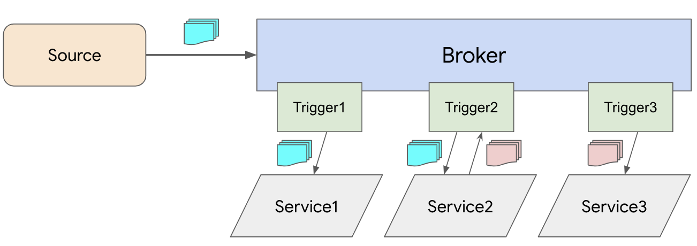

# Broker and Trigger Delivery

In [Complex Delivery with reply](complexdeliverywithreply.md) example, we see how an Event Source can fan out a message to multiple Services using Channels and Subscriptions. A Service can also reply to an event with another event for further delivery with other Channels and Subscriptions.

This model works but it's hard to maintain multiple Channels and Subscriptions. It also does not have the concept for filtering, so Services have to filter all messages themselves.

A simpler model to work with is Broker and Trigger. Broker combines channel, reply, and filter functionality into a single resource. Trigger provides declarative filtering of all events.

In the Broker and Trigger model, the [Complex Delivery with reply](complexdeliverywithreply.md) example can be done as follows:



In this example, only Service2 sends a reply but any Service can reply back. Replies are sent back into the Broker and filtered again.

## Broker

We need to inject a Broker in the namespace where we want to receive messages. Let's use the default namespace:

```bash
kubectl label ns default eventing.knative.dev/injection=enabled

namespace/default labeled
```

In a few seconds, you should see a Broker in the default namespace:

```bash
kubectl get broker

NAME      READY   REASON   URL
default   True             http://broker-ingress.knative-eventing.svc.cluster.local/default/default
```

There's also a default `InMemoryChannel` created and used by the Broker (but default channel can be [configured](https://knative.dev/docs/eventing/channels/default-channels/#setting-the-default-channel-configuration)):

```bash
kubectl get channel

NAME
inmemorychannel.messaging.knative.dev/default-kne-trigger
```

## Source

Create a `PingSource` to target the Broker. Define [source.yaml](../eventing/brokertrigger/source.yaml).

Create the source:

```bash
kubectl apply -f source.yaml

cronjobsource.sources.eventing.knative.dev/source created
```

## Services

Create Knative services that will subscribe to the Broker.

Define [service1.yaml](../eventing/brokertrigger/service1.yaml) and [service3.yaml](../eventing/brokertrigger/service3.yaml) which are services that log out received messages.

Define another [service2.yaml](../eventing/brokertrigger/service2.yaml) for the second service logs the received message and replies back with another CloudEvent with type `dev.knative.samples.hifromknative`. You can check out the source in [event-display-with-reply](../eventing/event-display-with-reply/csharp) folder.

Create services:

```bash
kubectl apply -f service1.yaml -f service2.yaml -f service3.yaml

service.serving.knative.dev/service1 created
service.serving.knative.dev/service2 created
service.serving.knative.dev/service3 created
```

## Triggers

Connect services to the Broker with Triggers.

Define [trigger1.yaml](../eventing/brokertrigger/trigger1.yaml). This filters
ping events and sends them to service1.

Define [trigger2.yaml](../eventing/brokertrigger/trigger2.yaml) for service2. It is the same as [trigger1.yaml](../eventing/brokertrigger/trigger1.yaml) except it points to service2.

Define [trigger3.yaml](../eventing/brokertrigger/trigger3.yaml). This filters `dev.knative.samples.hifromknative` events and sends them to service3.


Create triggers:

```bash
kubectl apply -f trigger1.yaml -f trigger2.yaml -f trigger3.yaml

trigger.eventing.knative.dev/trigger1 created
trigger.eventing.knative.dev/trigger2 created
trigger.eventing.knative.dev/trigger3 created
```

Under the covers, triggers creates the subscriptions:

```bash
kubectl get subscription

NAME                                                    READY
default-trigger1-8e05f7c3-702e-49b4-96f8-c46764aff45c   True
default-trigger2-6fdd4bf3-992e-4edd-ac57-466235c2a09c   True
default-trigger3-399562ed-65ec-4dba-bef2-0bb85d84081d   True
```

## Verify

Check running pods:

```bash
kubectl get pods

NAME                                                              READY STATUS    RESTARTS   AGE
cronjobsource-source-8653ad6d-2499-4b95-91a7-98fdee8f841d-wh6rk   1/1     Running   0          16m
service1-5mf7x-deployment-6bcdb4df9-pnhc4                         2/2     Running   0          5m19s
service2-fd752-deployment-9d589f7b7-m7r8j                         2/2     Running   0          5m19s
service3-hh6c7-deployment-7455c845cd-2ktr4                        2/2     Running   0          65s
```

Check the logs of the services.

In service1, you should see messages from the CronJobSource:

```bash
kubectl logs service1-5mf7x-deployment-6bcdb4df9-pnhc4 -c user-container

info: event_display.Startup[0]
      Event Display received event: {"message":"Hello world from cron!"}
```

In service2, you should see messages from the CronJobSource and outgoing replies:

```bash
kubectl logs service2-fd752-deployment-9d589f7b7-m7r8j -c user-container

info: event_display_with_reply.Startup[0]
      Received CloudEvent
      Id: 2eac9a1d-6f14-4343-a391-8f0fa504258d
      Source: /apis/v1/namespaces/default/cronjobsources/source
      Type: dev.knative.cronjob.event
      Data: {"message":"Hello world from cron!"}
info: event_display_with_reply.Startup[0]
      Replying with CloudEvent
      Id: a38095ae-7816-46a7-8464-2943e26bf66a
      Source: urn:knative/eventing/samples/hello-world
      Type: dev.knative.samples.hifromknative
      Data: "This is a Knative reply!"
```

In service3, you should see the replied messages:

```bash
kubectl logs service3-hh6c7-deployment-7455c845cd-2ktr4 -c user-container

info: event_display.Startup[0]
      Event Display received event: "This is a Knative reply!"
```
