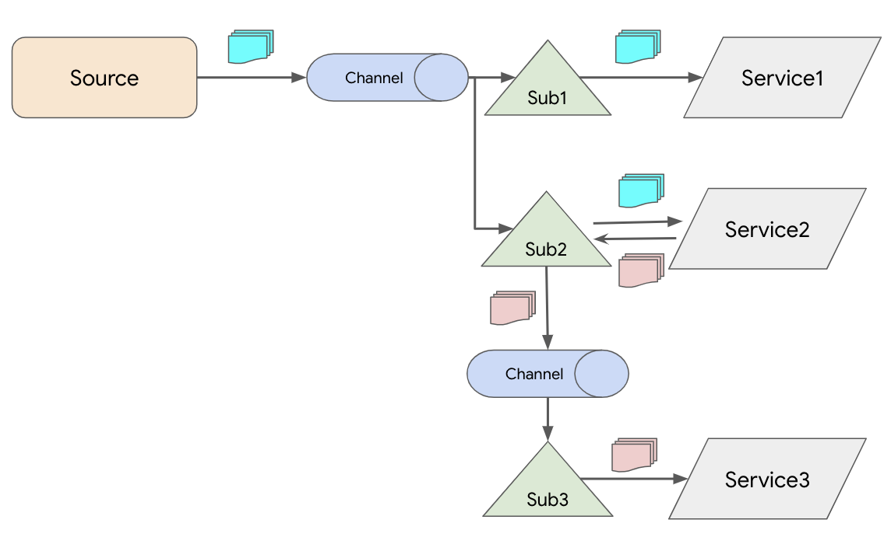

# Complex Delivery with reply

In [Complex Delivery](complexdelivery.md) example, we see how an Event Source can fan out a message multiple Services with a Channel and Subscriptions. A Service can also reply to an event with another event. This reply can further be routed to another Service with a Channel and a Subscription:



## Channels

Define two `InMemoryChannels` with [channel1.yaml](../eventing/complexwithreply/channel1.yaml) and [channel2.yaml](../eventing/complexwithreply/channel2.yaml):

Create the channels:

```bash
kubectl apply -f channel1.yaml -f channel2.yaml

inmemorychannel.messaging.knative.dev/channel1 created
inmemorychannel.messaging.knative.dev/channel2 created
```

## Source

Create a `CronJobSource` to target the first channel.

Define [source.yaml](../eventing/complexwithreply/source.yaml):

```yaml
apiVersion: sources.eventing.knative.dev/v1alpha1
kind: CronJobSource
metadata:
  name: source
spec:
  schedule: "* * * * *"
  data: '{"message": "Hello world from cron!"}'
  sink:
    apiVersion: messaging.knative.dev/v1alpha1
    kind: InMemoryChannel
    name: channel1
```

Create the source:

```bash
kubectl apply -f source.yaml

cronjobsource.sources.eventing.knative.dev/source created
```

## Services

Create Knative services that will subscribe to the first channel.

Define [service1.yaml](../eventing/complexwithreply/service1.yaml):

```yaml
apiVersion: serving.knative.dev/v1
kind: Service
metadata:
  name: service1
spec:
  template:
    spec:
      containers:
        - image: docker.io/meteatamel/event-display:v1
```

This simply logs out received messages.

Define another [service2.yaml](../eventing/complexwithreply/service2.yaml) for the second service:

```yaml
apiVersion: serving.knative.dev/v1
kind: Service
metadata:
  name: service2
spec:
  template:
    spec:
      containers:
        - image: docker.io/meteatamel/event-display-with-reply:v1
```

This logs the received message and replies back with another CloudEvent. You can check out the source in [event-display-with-reply](../eventing/event-display-with-reply/csharp) folder.

Create the services:

```bash
kubectl apply -f service1.yaml -f service2.yaml

service.serving.knative.dev/service1 created
service.serving.knative.dev/service2 created
```

## Subscriptions

Connect services to the channel with subscriptions.

Define [subscription1.yaml](../eventing/complexwithreply/subscription1.yaml):

```yaml
apiVersion: messaging.knative.dev/v1alpha1
kind: Subscription
metadata:
  name: subscription1
spec:
  channel:
    apiVersion: messaging.knative.dev/v1alpha1
    kind: InMemoryChannel
    name: channel1
  subscriber:
    ref:
      apiVersion: serving.knative.dev/v1
      kind: Service
      name: service1
```

Define another [subscription2.yaml](../eventing/complexwithreply/subscription2.yaml) for the second subscription.

```yaml
apiVersion: messaging.knative.dev/v1alpha1
kind: Subscription
metadata:
  name: subscription2
spec:
  channel:
    apiVersion: messaging.knative.dev/v1alpha1
    kind: InMemoryChannel
    name: channel1
  subscriber:
    ref:
      apiVersion: serving.knative.dev/v1
      kind: Service
      name: service2
  reply:
    ref:
      apiVersion: messaging.knative.dev/v1alpha1
      kind: InMemoryChannel
      name: channel2
```

Notice that the reply of the second service is routed to the second channel.

Create the subscriptions:

```bash
kubectl apply -f subscription1.yaml -f subscription2.yaml

subscription.messaging.knative.dev/subscription1 created
subscription.messaging.knative.dev/subscription2 created
```

## Handle reply

Finally, let's handle the reply messages from service2 to channel2.

Define [service3.yaml](../eventing/complexwithreply/service3.yaml) for the third service that simply logs out messages.

Define [subscription3.yaml](../eventing/complexwithreply/subscription3.yaml) that connects service3 to channel2.

Create service and subscription:

```bash
kubectl apply -f service3.yaml -f subscription3.yaml

service.serving.knative.dev/service3 created
subscription.messaging.knative.dev/subscription3 created
```

## Verify

Check the running pods:

```bash
kubectl get pods

NAME                                                              READY STATUS    RESTARTS   AGE
cronjobsource-source-8653ad6d-2499-4b95-91a7-98fdee8f841d-wh6rk   1/1     Running   0          16m
service1-5mf7x-deployment-6bcdb4df9-pnhc4                         2/2     Running   0          5m19s
service2-fd752-deployment-9d589f7b7-m7r8j                         2/2     Running   0          5m19s
service3-hh6c7-deployment-7455c845cd-2ktr4                        2/2     Running   0          65s
```

Check the logs of the services.

In service1, you should see messages from the CronJobSource:

```bash
kubectl logs service1-5mf7x-deployment-6bcdb4df9-pnhc4 -c user-container

info: event_display.Startup[0]
      Event Display received event: {"message":"Hello world from cron!"}
```

In service2, you should see messages from the CronJobSource and outgoing replies:

```bash
kubectl logs service2-fd752-deployment-9d589f7b7-m7r8j -c user-container

info: event_display_with_reply.Startup[0]
      Received CloudEvent
      Id: 2eac9a1d-6f14-4343-a391-8f0fa504258d
      Source: /apis/v1/namespaces/default/cronjobsources/source
      Type: dev.knative.cronjob.event
      Data: {"message":"Hello world from cron!"}
info: event_display_with_reply.Startup[0]
      Replying with CloudEvent
      Id: a38095ae-7816-46a7-8464-2943e26bf66a
      Source: urn:knative/eventing/samples/hello-world
      Type: dev.knative.samples.hifromknative
      Data: "This is a Knative reply!"
```

In service3, you should see the replied messages:

```bash
kubectl logs service3-hh6c7-deployment-7455c845cd-2ktr4 -c user-container

info: event_display.Startup[0]
      Event Display received event: "This is a Knative reply!"
```
